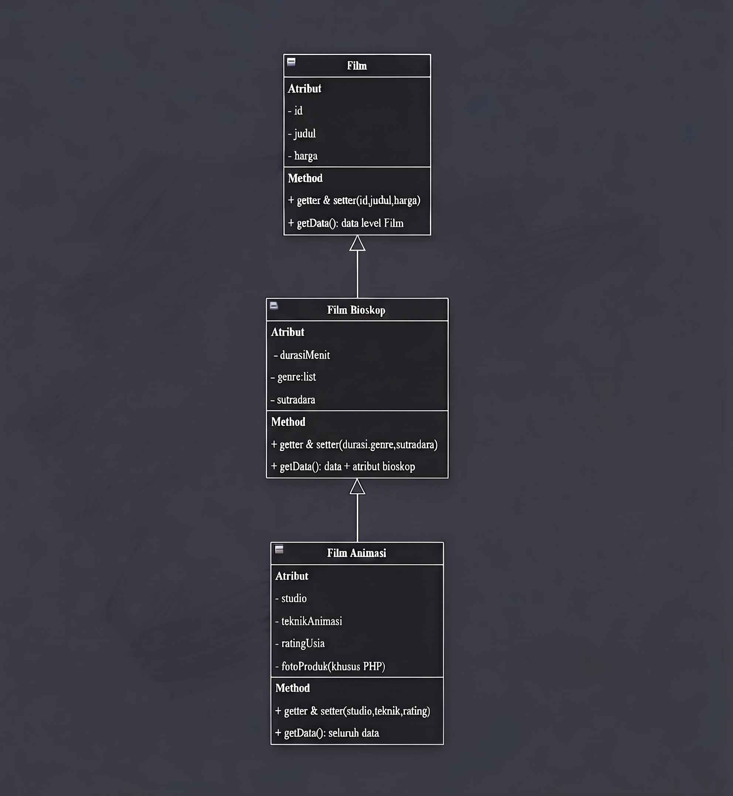

# 🎬 Data Film Bioskop (Multilevel Inheritance)

Program manajemen **Data Film Bioskop** yang dibangun dengan konsep **OOP Multilevel Inheritance**
di dalam **4 bahasa pemrograman**: **C++ (CPP)**, **Java**, **Python**, dan **PHP**.

- **CPP, Java, Python**: program CLI (konsol) — input lewat keyboard per-field.
- **PHP**: program web — input lewat form HTML, data disimpan di `$_SESSION`.

---

## ❤️ Janji

Saya Jaka Permana Herawan dengan NIM 2509371 mengerjakan Tugas Praktikum 2 pada Mata Kuliah Desain dan Pemrograman Berorientasi Objek (DPBO) untuk keberkahan-Nya maka saya tidak melakukan kecurangan seperti yang telah dispesifikasikan. Aamiin

---

## 🎨 Deskripsi Singkat Desain Program dan Diagram

Program ini mensimulasikan pendataan film di sebuah gedung bioskop. Seluruh data film (mulai dari film
biasa, film bioskop, hingga film animasi) **ditampilkan dalam SATU TABEL DINAMIS** yang lebarnya
menyesuaikan isi data, dan user dapat **menambahkan data baru** (melalui input keyboard pada CLI,
atau form pada PHP).



Hierarki class memakai **multilevel inheritance** yang masuk akal di dunia nyata, karena
*"Film Animasi" adalah "Film Bioskop"* (tayang di gedung bioskop) dan *"Film Bioskop" adalah "Film"*:

```
Film (class dasar / level 1)
   │
   ├──> FilmBioskop (level 2, EXTENDS Film)
   │        │
   │        └──> FilmAnimasi (level 3, EXTENDS FilmBioskop)
```

Setiap class memiliki **minimal 3 atribut**:

| Class | Atribut milik class |
| ----- | ------------------- |
| `Film` | `id`, `judul`, `harga` |
| `FilmBioskop` | `durasiMenit`, `genre` (boleh lebih dari satu), `sutradara` |
| `FilmAnimasi` | `studio`, `teknikAnimasi`, `ratingUsia` (+ `fotoProduk` **khusus PHP**) |

---

## 📁 Struktur Folder

```
TP2DPBO2526C2/
├── README.md
├── Dokumentasi/
│   ├── Diagram.png                     (diagram desain class)
│   ├── CPP, Java, Python/              (13 screenshot: tampilan menu + error handling CLI)
│   │   ├── Tampilan Menu.png
│   │   ├── Input Bukan Angka.png
│   │   ├── ID Negatif.png
│   │   ├── ID = 0.png
│   │   ├── ID Sudah Dipakai.png
│   │   ├── Harga Negatif.png
│   │   ├── Durasi Negatif.png
│   │   ├── Jumlah Genre Kurang Dari 1.png
│   │   ├── Genre Tidak Diawali Huruf Besar.png
│   │   ├── Tipe Film Di Luar 1-3.png
│   │   ├── Teknik Animasi Di Luar Rentang.png
│   │   ├── Rating Usia Di Luar Rentang.png
│   │   └── Sukses Ditambahkan.png
│   └── PHP/                            (15 screenshot: tampilan menu + error handling web)
│       ├── Tampilan Menu1.png
│       ├── Tampilan Menu2.png
│       ├── Input Bukan Angka.png
│       ├── ID Negatif.png
│       ├── ID = 0.png
│       ├── ID Sudah Dipakai.png
│       ├── Judul Kosong.png
│       ├── Harga Bukan Angka.png
│       ├── Harga Negatif.png
│       ├── Durasi Bukan Angka.png
│       ├── Durasi Negatif.png
│       ├── Genre Tidak Diawali Huruf Besar.png
│       ├── Genre Kurang Dari 1.png
│       ├── Foto Produk Berupa URL Bukan Path.png
│       └── Data Berhasil Ditambahkan.png
├── CPP/
│   ├── main.cpp                        (program utama CLI)
│   ├── Film.cpp
│   ├── FilmBioskop.cpp
│   ├── FilmAnimasi.cpp
│   └── testcase.txt                    (input uji coba: 2 data tambahan)
├── Java/
│   ├── Main.java                       (program utama)
│   ├── Film.java
│   ├── FilmBioskop.java
│   ├── FilmAnimasi.java
│   └── testcase.txt                    (input uji coba: 2 data tambahan)
├── PHP/
│   ├── index.php                       (program utama web: form + tabel)
│   ├── Film.php
│   ├── FilmBioskop.php
│   ├── FilmAnimasi.php
│   └── foto_produk/                    (poster film, dipakai kolom Foto Produk)
│       ├── Dragon Slayer.png
│       ├── Kimetsu No Yaiba.png
│       └── One Piece.png
└── Python/
    ├── main.py                         (program utama CLI)
    ├── Film.py
    ├── FilmBioskop.py
    ├── FilmAnimasi.py
    └── testcase.txt                    (input uji coba: 2 data tambahan)
```

> Catatan: **PHP tidak memiliki `testcase.txt`** karena input dilakukan lewat form web, bukan keyboard.

---

## ✨ Penjelasan Atribut dan Methods

Penamaan mengikuti konvensi tiap bahasa:

| Bahasa | Konstruktor | Contoh penamaan method |
| ------ | ----------- | ---------------------- |
| C++ / Java | `Film(...)` |  `getId()`, `getData()`, `getGenreText()` |
| Python | `__init__(...)` |  `get_id()`, `get_data()`, `get_genre_text()` |
| PHP | `__construct(...)` (semua parameter punya **nilai default**) | `getId()`, `getData()`, `getGenreText()` |

### 1. Class `Film` (superclass / level 1)

Atribut:

| Atribut   | Tipe   | Keterangan                                   |
| --------- | ------ | -------------------------------------------- |
| `id`      | int    | Nomor unik film                              |
| `judul`   | string | Judul film                                   |
| `harga`   | int    | Harga tiket film dalam Rupiah                |

Methods:

| Method | Keterangan |
| ------ | ---------- |
| `Film(id, judul, harga)` | Konstruktor untuk mengisi atribut |
| `getId() / setId(id)` | Getter & setter atribut `id` |
| `getJudul() / setJudul(judul)` | Getter & setter atribut `judul` |
| `getHarga() / setHarga(harga)` | Getter & setter atribut `harga` |
| `~Film()` | Destruktor (**khusus C++**) |
| `getData()` | Mengembalikan 3 kolom data milik class `Film` (harga sudah format Rupiah) |

### 2. Class `FilmBioskop` (turunan `Film` / level 2)

Mewarisi semua atribut & method `Film` (karena `FilmBioskop` IS-A `Film`), lalu menambah:

Atribut:

| Atribut          | Tipe   | Keterangan                    |
| ---------------- | ------ | ----------------------------- |
| `durasiMenit`    | int    | Durasi film dalam menit       |
| `genre`          | daftar string | Daftar genre film (boleh lebih dari 1, contoh: `["Drama", "Romance"]`) |
| `sutradara`      | string | Nama sutradara film           |

Methods:

| Method | Keterangan |
| ------ | ---------- |
| `FilmBioskop(id, judul, harga, durasiMenit, genre, sutradara)` | Konstruktor (memanggil `super()` / `parent::` / `Film(...)`) |
| `getDurasiMenit() / setDurasiMenit()` | Getter & setter `durasiMenit` |
| `getGenre() / setGenre()` | Getter & setter daftar `genre` |
| `getGenreText()` | Menggabungkan daftar genre menjadi satu string pisah koma (contoh: `Drama, Romance`) |
| `getSutradara() / setSutradara()` | Getter & setter `sutradara` |
| `getData()` | Data `Film` + 3 kolom bioskop (6 kolom, `durasi` sudah format jam & `harga` format Rupiah) |

### 3. Class `FilmAnimasi` (turunan `FilmBioskop` / level 3)

Mewarisi seluruh atribut & method dari `Film` dan `FilmBioskop`, lalu menambah:

Atribut:

| Atribut          | Tipe   | Keterangan                               |
| ---------------- | ------ | ---------------------------------------- |
| `studio`         | string | Studio animasi pembuat film              |
| `teknikAnimasi`  | string | Teknik animasi (12 pilihan, lihat daftar menu di bawah) |
| `ratingUsia`     | string | Rating usia penonton (`SU` / `13+` / `17+` / `21+`) |
| `fotoProduk`     | string | Path poster film (**KHUSUS PHP**)        |

Methods:

| Method | Keterangan |
| ------ | ---------- |
| `FilmAnimasi(id, judul, harga, durasiMenit, genre, sutradara, studio, teknikAnimasi, ratingUsia[, fotoProduk])` | Konstruktor (memanggil `super()` / `parent::`); `fotoProduk` hanya ada di PHP (default `""`) |
| `getStudio() / setStudio()` | Getter & setter `studio` |
| `getTeknikAnimasi() / setTeknikAnimasi()` | Getter & setter `teknikAnimasi` |
| `getRatingUsia() / setRatingUsia()` | Getter & setter `ratingUsia` |
| `getFotoProduk() / setFotoProduk()` | Getter & setter `fotoProduk` (**khusus PHP**) |
| `getData()` | Seluruh data (9 kolom, di PHP 10 kolom) |


---

## 💻 Alur Program (CPP / Java / Python)

```
MULAI
  │
  ├─ 1. BENTUK 5 OBJEK AWAL (hard-coded di main, SEBELUM input user):
  │       • Film(1, "Sejarah", 25000)
  │       • FilmBioskop(2, "Kimi No Nawa", 45000, 115, ["Drama", "Romance"], "Sari")
  │       • FilmBioskop(3, "Ghost In The Cell", 40000, 95, ["Horor"], "Rina")
  │       • FilmAnimasi(4, "Konosuba", 50000, 105, ["Aksi", "Petualangan"], "Andi", "StudioBiru", "3D", "SU")
  │       • FilmAnimasi(5, "Dragon Slayer", 52000, 98, ["Fantasi"], "Dewi", "StudioUngu", "2D", "SU")
  │       (PHP: data sama, tetapi ID 4 judulnya "Kimetsu No Yaiba" dengan
  │        fotoProduk "foto_produk/Kimetsu No Yaiba.png", ID 5 fotoProduk
  │        "foto_produk/Dragon Slayer.png")
  │
  ├─ 2. TAMPILKAN 5 DATA AWAL dalam SATU TABEL DINAMIS
  │       (kolom gabungan dari semua class; kolom milik class lain diisi "-",
  │       harga format Rupiah, durasi format jam, baris diurutkan per ID)
  │
  ├─ 3. TERIMA INPUT USER UNTUK MENAMBAH DATA:
  │       a. user memasukkan jumlah data yang ditambah (harus lebih dari 0)
  │       b. untuk setiap data, program menanyakan input SATU PER SATU (per-field):
  │            - pilih tipe class (1 = Film, 2 = FilmBioskop, 3 = FilmAnimasi)
  │            - [tipe >= 1] ID, Judul, Harga
  │            - [tipe >= 2] Durasi (menit), Jumlah genre, genre ke-1..ke-n,
  │              Sutradara  → genre harus diawali huruf besar & boleh lebih dari 1
  │            - [tipe == 3] Studio, lalu pilih Teknik animasi & Rating usia lewat MENU angka
  │
  ├─ 4. TAMPILKAN SELURUH DATA (data awal + data baru) dalam SATU TABEL
  │
  └─ 5. SELESAI ("Program selesai. Terima kasih!")
```

---

## 📷 Dokumentasi

### Tampilan Menu Awal

#### C++(CPP), Java, Python:


#### PHP:


### ERROR HANDLING

Cara penanganan error:

- **CLI (C++ / Java / Python)**: pesan error tampil **merah** tepat di bawah input yang salah,
  lalu program **mengulang input field tersebut** sampai valid.
- **PHP**: seluruh error form ditampilkan **sekaligus** dalam kotak merah
  `⚠ Penyimpanan gagal:` di atas tabel, diawali nama field + `—`,
  lalu ditutup `Periksa kembali isian form Anda.` — data tidak disimpan selama masih ada error.

#### C++(CPP), Java, Python:

**1. Input bukan angka** — pesan: `Input harus berupa angka! Silakan coba lagi.`


**2. ID negatif** — pesan: `ID tidak boleh negatif!`


**3. ID = 0** — pesan: `ID harus angka mulai dari 1!`


**4. ID sudah dipakai** — pesan: `ID sudah dipakai! Gunakan ID lain.`


**5. Harga negatif** — pesan: `Harga tidak boleh negatif!`


**6. Durasi negatif** — pesan: `Durasi tidak boleh negatif!`


**7. Jumlah genre / jumlah data kurang dari 1** — pesan: `Input harus lebih dari 0!`


**8. Genre tidak diawali huruf besar** — pesan: `Huruf awal genre harus huruf besar!`


**9. Tipe film di luar 1–3** — pesan: `Tipe harus 1, 2, atau 3!`


**10. Teknik animasi di luar rentang (1–12)** — pesan: `Pilihan harus 1-12!`


**11. Rating usia di luar rentang (1–4)** — pesan: `Pilihan harus 1-4!`


**12. Sukses menambahkan data (umpan balik hijau, bukan error)** — pesan: `Data berhasil ditambahkan!`


#### PHP:

**1. Input bukan angka** — pesan: `ID — Input harus berupa angka! Silakan coba lagi.`


**2. ID negatif** — pesan: `ID — ID tidak boleh negatif!`


**3. ID = 0** — pesan: `ID — ID harus angka mulai dari 1!`


**4. ID sudah dipakai** — pesan: `ID — ID sudah dipakai! Gunakan ID lain.`


**5. Judul kosong** — pesan: `Judul — Judul tidak boleh kosong!`


**6. Harga bukan angka** — pesan: `Harga — harga harus berupa angka!`


**7. Harga negatif** — pesan: `Harga — harga tidak boleh negatif!`


**8. Durasi bukan angka** — pesan: `Durasi — durasi harus berupa angka!`


**9. Durasi negatif** — pesan: `Durasi — durasi tidak boleh negatif!`


**10. Genre tidak diawali huruf besar** — pesan: `Genre — huruf awal genre harus huruf besar!`


**11. Genre kurang dari 1** — pesan: `Genre — minimal satu genre!`


**12. Foto produk berupa link/URL, bukan path file lokal** — pesan: `Foto produk — path tidak boleh berupa link/URL! (isi jalur file lokal)`


**13. Sukses menambahkan data (umpan balik hijau, bukan error)** — pesan: `Data berhasil ditambahkan!`


